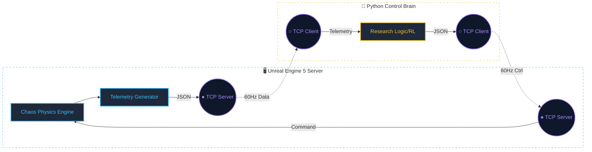

# UE5 Aerospace Simulation Platform ✈️

A high-fidelity bridge between **Unreal Engine 5** and **Python**, designed for aerospace research and autonomous flight development.

## 📌 Project Overview
Built on real-world Indian terrain data (ISRO Bhuvan), this platform enables real-time flight simulation with an external Python API for PID control, telemetry analysis, and future Reinforcement Learning research.

## 📂 Repository Structure
| Folder | Contents |
| :--- | :--- |
| **`/sim`** | UE5 project, 3D assets, and terrain levels. |
| **`/python`** | TCP Client, Aerodynamics logic, and Autopilot scripts. |
| **`/docs`** | Research notes and IIT Internship pitch materials. |
| **`/data`** | Telemetry logs and exported flight CSV data. |

## 👥 The Team
| Name | Role |
| :--- | :--- |
| **Adhiraj Somanse** | Project Lead — UE5, Blueprints, Rendering |
| **Rajguru&nbsp;Kudnekar** | Research Systems — Python, Aero-physics, TCP |

## 🛠 Tech Stack
* **Engine:** Unreal Engine 5 (DLSS Enabled)
* **API:** Python 3.10+ via TCP Socket
* **Terrain:** ISRO Bhuvan DEM Data

